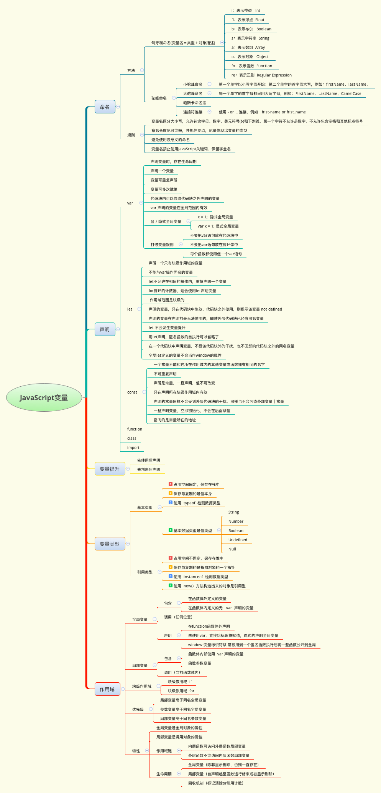
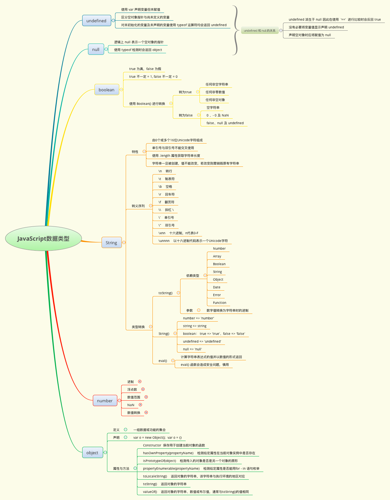
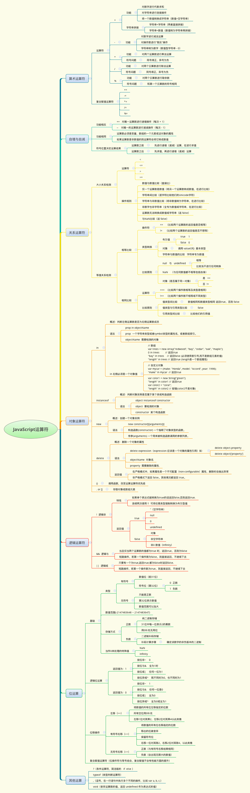
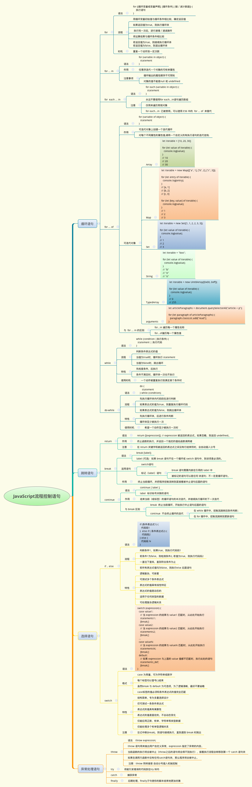
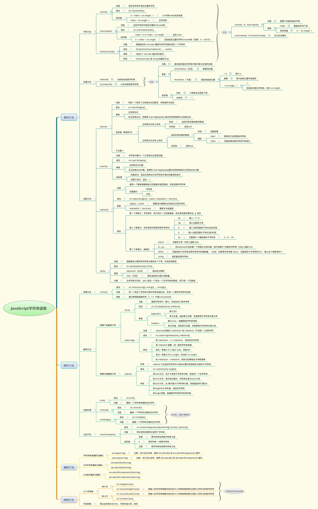
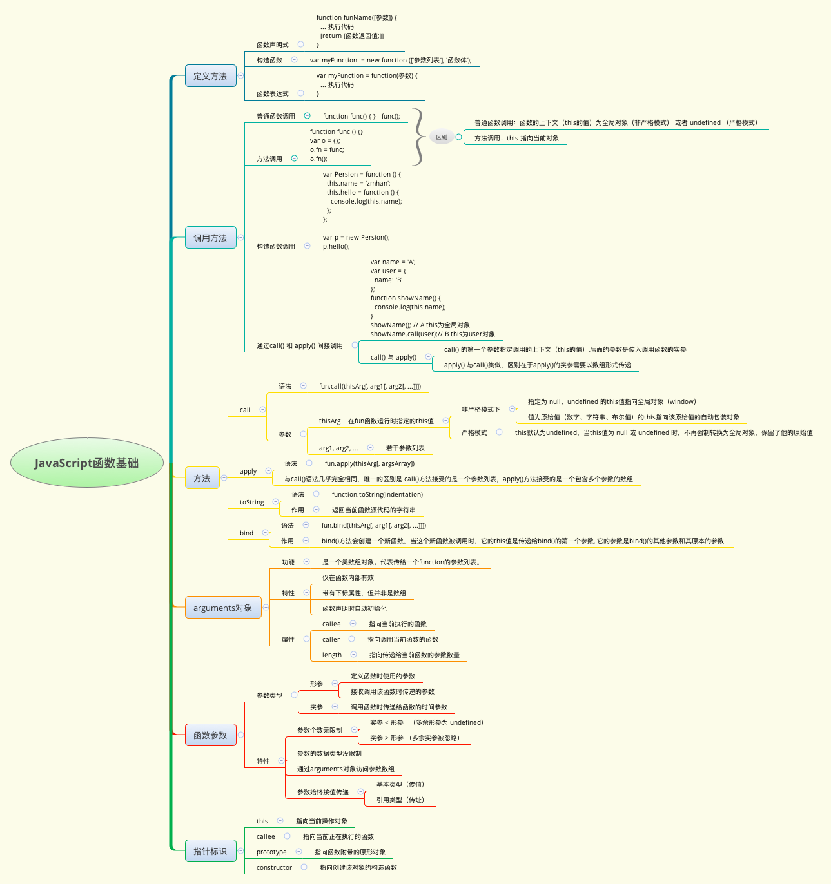

* <a href="#js-00">JavaScript 变量</a>
* <a href="#js-01">JavaScript 数据类型</a>
* <a href="#js-02">JavaScript 运算符</a>
* <a href="#js-03">JavaScript 流程控制语句</a>
* <a href="#js-04">JavaScript 字符串函数</a>
* <a href="#js-05">JavaScript 函数基础</a>
* <a href="#js-06">window对象</a>

## JavaScript 变量

## JavaScript 数据类型

## JavaScript 运算符

## JavaScript 流程控制语句

## JavaScript 字符串函数

## JavaScript 函数基础

## Window 对象

