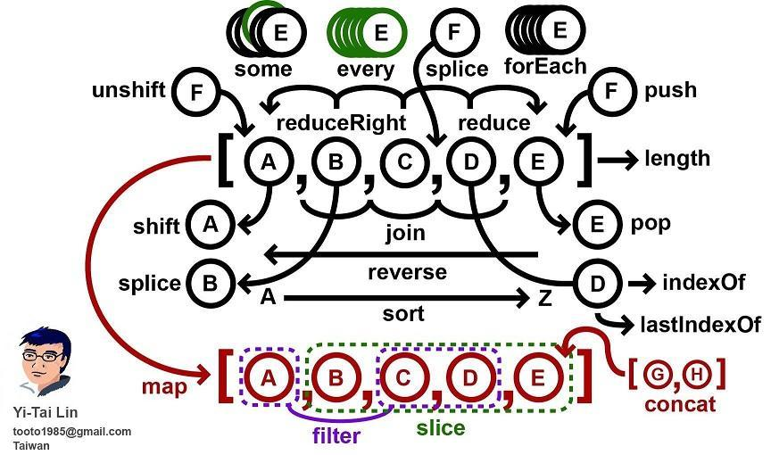
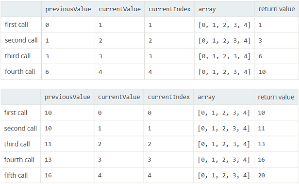

## JavaScript 数组常用方法介绍



* 遍历：<a href="#forEach">`forEach()`</a> 、 <a href="#map">`map()`</a> 、 <a href="#filter">`filter()`</a>
* 查找：<a href="#some">`some()`</a> 、 <a href="#every">`every()`</a>
* 迭代运算：<a href="#reduce">`reduce()`</a> 、 <a href="reduceRight">`reduceRight()`</a>
* 处理数组：<a href="#slice">`slice()`</a> 、<a href="#splice">`splice()`</a>
* 返回项目索引值：<a href="#indexOf">`indexOf()`</a> 、 <a href="#lastIndexOf">`lastIndexOf()`</a>
* 排序：<a href="#sort">`sort()`</a>、<a href="#reverse">`reverse()`</a>
* 数组内添加数据：<a href="#push">`push()`</a>、<a href="#unshift">`unshift()`</a>
* 数组内删除数据：<a href="#pop">`pop()`</a>、<a href="#shift">`shift()`</a>
* 合并数组：<a href="concat">concat()</a>
* 数组拼接为字符串：<a href="join">join()</a>
* 判断是否是数组：<a href="isArray">isArray()</a>
* 类数组


#### <span id="forEach">forEach() － 遍历数组</span>

函数声明：`[].forEach( function(value, index, array) { … }, [thisArg] );`

* 第一个参数是回调函数，它支持3个参数，第1个是遍历的数组内容，第2个是对应索引，第3个是数组自身。
* 第二个参数thisArg可选，可用于以改变回调函数里面的this指针

用console.log看一下回调函数的3个参数:


```js
[1, 2 ,3, 4].forEach(console.log);
// 1, 0, [1, 2, 3, 4]
// 2, 1, [1, 2, 3, 4]
// 3, 2, [1, 2, 3, 4]
// 4, 3, [1, 2, 3, 4]
```
上面已经清晰地展现了遍历的结果，第一列是value，第二列是对应的index值，第三列是数组本身。

`forEach()` 实现数组求和：

```js
let sum = 0;
[1, 2, 3, 4, 0.5, 0.8, 7].forEach(value => sum += value);
console.log(sum); // 18.3

```

现在看看第二个参数 `thisArgs` 的作用，如果不指定该参数，回调函数内的 `this` 指向的是`window`(关于[this](http://www.jianshu.com/p/3177b1f82bc0))，例如上例中的回调函数里，你可以写成 `this.sum += value` ，效果是一样的（当然前提是变量确实是window的全局属性）。但有时 `this` 指向 `window` 就不对了，如下：

```js
var group = {
    members: ["Jack", "Andy", "Natasha"],
    joinParty: "Yes",
    getInfo: function (m) {
        this.isJoinParty(m);
        console.log(m + " " + this.joinParty);
    },
    isJoinParty: function (m) {
        switch(m) {
        case "Andy" :
            this.joinParty = "No";
            break;
        default:
            this.joinParty = "Yes";
            break;
        }
    }
};
group.members.forEach(group.getInfo);
```

以上代码会报`Error`。从代码里看`getInfo`函数里的`this`应该指向`group`对象，但遗憾地是`getInfo`作为`[].forEach()`的回调函数时相当于普通函数，因此`getInfo`里的`this`指向的是`window`。而`window`对象里显然不存在`isJoinParty`。

正确的调用方式如下：

```js
group.members.forEach(group.getInfo, group);
//Jack Yes
//Andy No
//Natasha Yes
```

#### <span id="map">map() － 映射创建新数组</span>

函数声明：`[].map( function(value, index, array) { … }, [thisArg] );`。

你可以把`map`理解为`forEach`的一个特例，专门用于：通过现有的数组建立新数组。
唯一需要注意的的是回调函数需要有`return`值，否则新数组都是`undefined`。

```js
var trimmed = ['    Jack','Betty    ','    Chirs    '].map(s => s.trim());
//需要return值，否则新数组里都是undefined
console.log(trimmed);    //["Jack", "Betty", "Chirs"]
```

#### <span id="filter">filter() - 过滤数组</span>

函数声明：`[].filter( function(value, index, array) { … }, [thisArg] );`。

和forEach一样。唯一需要注意的的是回调函数需要`return`布尔值`true`或`false`，如果忘记写`return`语句，返回得到的是空数组，表示一个都不匹配。例如：

```js
var newArray1 = [0, 1, 2].filter(value => {});
console.log(newArray1);         //[]，没有return语句得到的是空数组

//过滤出不超过10的正数
var newArray2 = [0, 1, 2, 14].filter(value => value > 0 && value <= 10);
console.log(newArray2);   //[1, 2]
```

#### <span id="some">some() - 检测是否符合某一个条件</span>
#### <span id="every">every() - 检测是否全部符合条件 </span>

<b>some</b>的函数声明：`[].some( function(value, index, array) { … }, [thisArg] )`;

<b>every</b>的函数声明：`[].every( function(value, index, array) { … }, [thisArg] )`;

同forEach()一样，唯一需要注意的的是回调函数需要return布尔值true或false，如果忘记写return语句，表示不满足条件，返回false。

```js
[1, 10, 100].some(function(x) { x > 5; });         //false，忘记写return了
[1, 2, 3, 4, 5].every(function(x) { x > 0; });     //false，忘记写return了

[1, 10, 100].some(x => x > 5);     // true
[1, 10, 100].some(x => x < 0);     // false
[1, 2, 3, 4, 5].every(x => x > 0);     // true
[1, 2, 3, 4, 5].every(x => x < 3);     // false
```

#### <span id="reduce">reduce() </span>
#### <span id="reduceRight">reduceRight()</span>

两者都是用于迭代运算。区别是 `reduce()` 从头开始迭代，`reduceRight()` 从尾开始迭代。

<b>reduce</b> 的函数声明：`[].reduce( function(previousValue, currentValue, currentIndex, array) { … }, [initialValue]);`

<b>reduceRight</b> 的函数声明：`[].reduceRight( function(previousValue, currentValue, currentIndex, array) { … }, [initialValue]);`

第一个参数是回调函数，有4个参数：
* `previousValue`： 前一个值
* `currentValue`： 当前值
* `currentIndex`：当前索引
* `array`：数组本身

第二个参数`initialValue`可选，表示初始值。如果省略，初始值为数组的第一个元素，这样的话回调函数里`previousValue`就是第一个元素，`currentValue`是第二个元素。因此不设`initialValue`的话，会少一次迭代。例如：

```js
var sum1 = [1, 2, 3, 4].reduce((previous, current) => previous + current);
console.log(sum1); //10

var sum2 = [1, 2, 3, 4].reduce((previous, current) => previous + current, 10);
console.log(sum2); // 20
```

下图清楚地表明了各个运算步骤，如果不设initialValue，会少一次迭代:



用 `reduce` 和 `reduceRight` 很容易就能实现二维数组扁平化，如下：

```js
var flat1 = [[0, 1], [2, 3], [4, 5]].reduce((a, b) => a.concat(b));
console.log(flat1); // [0, 1, 2, 3, 4, 5]

var flat2 = [[0, 1], [2, 3], [4, 5]].reduceRight((a, b) => a.concat(b));
console.log(flat2); // [4, 5, 2, 3, 0, 1];
```

#### <span id="slice">slice() - 选择数组中的一部分元素。</span>

<b>slice</b>用于复制数组，复制完后旧数组不变，返回得到的新数组是旧数组的子集。
函数声明：`[].slice(begin, [end])`。

参数：
* begin：开始复制的位置，需要注意的是，可以设负数。设负数表示从尾往前数几个位置开始复制。例如slice(-2)将从倒数第2个元素开始复制。另外需要注意的是，该参数虽未标注为可选，但实际上是可以省略的，省略的话默认为0。
* end：可选，表示复制到该位置的前一个元素。例如slice(0,3)将得到前3个元素，但不包含第4个元素。不设的话默认复制到数组尾，即等于array.length。

```js
['a', 'b', 'c', 'd'].slice(1);  //return ["b", "c", "d"]
['a', 'b', 'c', 'd'].slice(1,2);  //return ["b"]
['a', 'b', 'c', 'd'].slice(-1);  //return ["d"]
```

当然`slice`最常见的是用在将类数组`arguments`对象转换为真正的数组：

```js
var args = [].slice.call(arguments);
```

#### <span id="splice">splice() - 用于剥离数组，从旧数组中移除元素，返回得到的新数组是被移除的元素</span>

函数声明：`[].splice(start, deleteCount, [item…])`。

参数：
* start：开始剥离的位置（可以设负数）。设负数表示从尾往前数几个位置开始剥离。例如splice (-2)将从倒数第2个元素开始剥离。
* deleteCount：要剥离的元素个数，设0表示一个都不剥离。
* [item...]：（可选），用于替换旧数组中被移除的元素

```js
var oldArray = ['a', 'b', 'c'];
var newArray = oldArray.splice(1, 2, 'Jack', 'Betty', 'Andy');
console.log(oldArray);     //["a", "Jack", "Betty", "Andy"]
console.log(newArray);     //["b", "c"]
```

一个常见的应用就是删除数组内某元素，用`delete`的话会留下空洞，应该用`splice`方法：

```js
//错误的方法用delete
var arr = [0, 1, 2, 3, 4];
delete arr[2];
console.log(arr);     //[0, 1, undefined, 3, 4]

//正确的方法用splice
arr.splice(2, 1);
console.log(arr);     //[0, 1, 3, 4]
```

#### <span id="indexOf">indexOf()</span>
#### <span id="lastIndexOf">lastIndexOf()</span>

两者都用于返回项目的索引值。区别是 `indexOf()` 从头开始找，`lastIndexOf()` 从尾开始找。如果查找失败，无匹配，返回-1。

<b>indexOf</b>的函数声明：`[].indexOf(searchElement, [fromIndex = 0])`;。

<b>lastIndexOf</b>的函数声明：`[].lastIndexOf(searchElement, [fromIndex = arr.length – 1])`;

第一个参数`searchElement`即需要查找的元素。第二个参数`fromIndex`可选，指定开始查找的位置。如果忽略，`indexOf`默认是0，`lastIndexOf`默认是数组尾。

```js
['a', 'b', 'd', 'e'].indexOf('b');      //1
['a', 'b', 'd', 'e'].indexOf('b', 2);   //-1,从2号位开始找没找到
['a', 'b', 'd', 'e'].indexOf('c');      //-1,没找到

['a', 'b', 'd', 'e'].lastIndexOf('b');      //1
['a', 'b', 'd', 'e'].lastIndexOf('b', 2);   //1,逆向2号位等价于正向1号位
['a', 'b', 'd', 'e'].lastIndexOf('c');      //-1,没找到
```

#### <span id="sort">sort()</span> - 数组排序

<b>sort<b>用于排序数组，函数声明：`[].sort([sortfunction]);`

它就一个参数，就是排序函数指针。而且是可选的，不设的话有默认的排序函数，数字的话会升序排列，string会根据Unicode升序排列。

```js
var sumArray = [4, 3, 1, 0, 2];
var sumArray2 = ['d', 'z', 'a'];
sumArray.sort();
sumArray2.sort();
console.log(sumArray);  //[0, 1, 2, 3, 4]
console.log(sumArray2); //["a", "d", "z"]
```

但是内置的默认排序函数，是不可靠的，如下：

```js
var scores = [1, 10, 2, 21];
scores.sort();
console.log(scores);    //[1, 10, 2, 21]
```

因此保险起见最好自定义排序函数：

```js
var scores = [1, 10, 2, 21];
scores.sort((a, b) => a > b);
console.log(scores); // [1, 2, 10, 21]
```

而且如果数组内是对象，或排序逻辑复杂的话，那默认排序函数更是力不从心了，必须自定义排序函数：

```js
var items = [
    { name: 'Jack', value: 37 },
    { name: 'Betty', value: 21 },
    { name: 'Andy', value: 45 }
];
items.sort((a, b) => a.value > b.value);
console.log(items);
//  [
//      { name: 'Betty', value: 21 },
//      { name: 'Jack', value: 37 },
//      { name: 'Andy', value: 45 }
//  ]
```


#### <span id="reverse">`array.reverse()`</span> - 把数组元素顺序逆转

```js
var arr = [1, 3, 2];
arr.reverse();        // return [2, 3, 1]
```

#### <span id="push">`array.push()`</span> - 往数组的末尾新增一个或多个元素

```js
var arr = [];
arr.push(1);
console.log(arr); // [1]
```

#### <span id="unshift">`array.unshift()`</span> - 往数组的开头新增一个或多个元素

```js
var arr = [1, 2, 3, 4];
arr.unshift(0);
console.log(arr); // [0, 1, 2, 3, 4]
```

#### <span id="pop">`array.pop()`</span> - 删除数组最后一位元素

```js
var arr = [1, 2, 3];
arr.pop();
console.log(arr); // [1, 2]
```

#### <span id="shift">`array.shift()`</span> - 删除数组第一位元素

```js
var arr = [1, 2, 3];
arr.shift();
console.log(arr); // [2, 3]
```

#### <span id="concat">`array.concat()`</span> - 合并数组或合并数组的值

```js
[1, 2, 3].concat(4, 5);   // return [1, 2, 3, 4, 5]
```

#### <span id="join">`array.join()`</span> - 合并数组所有元素拼接成字符串
```js
[1, 2, 3].join();     // return '1,2,3'
[1, 2, 3].join('');     // return '123'
[1, 2, 3].join('@')   // return '1@2@3'
```

#### <span id="isArray">`Array.isArray()`</span> - 是否是数组。IE9+ 支持该方法。

```js
Array.isArray(3);   // return false
Array.isArray({});  // return false
Array.isArray([]);  // return true
```

详细的判断方法可参考 [Javascript 中判断数组的正确姿势](./Javascript 中判断数组的正确姿势.md)

#### 类数组

JS里有很多类数组对象。什么叫类数组对象呢？它们首先是对象，并没有继承`Array`，但长的却很像数组。最典型的如`arguments`对象，`HTMLCollection`对象。

类数组对象不能直接使用数组方法，但数组方法是如此简单便利，要在类数组对象身上使用数组方法，需要让数组函数通过`call`绑定类数组对象。

处理arguments对象：

```js
ar args = [].slice.call(arguments);
```

处理HTMLCollection对象：

```js
//用forEach遍历页面所有div，输入className
var divs = document.getElementsByTagName("div");
Array.prototype.forEach.call(divs, div => console.log("该div类名是：" + (div.className || "空")));

//下面这样直接调用forEach将报错，因为divs是HTMLCollection对象而非Array
divs.forEach(div => console.log("该div类名是：" + (div.className || "空")));
```

处理字面量对象：

```js
var arrayLike = { 0: "a", 1: "b", 2: "c", length: 3 };
var result = Array.prototype.map.call(arrayLike, s => s.toUpperCase());
console.log(result);    //["A", "B", "C"]
```

处理字符串：

```js
var result = Array.prototype.map.call("abc", s => s.toUpperCase());
console.log(result);    //["A", "B", "C"]
```

但`Array`的`concat`会检查参数的`[[Class]]`属性，只有参数是一个真实的数组才会将数组内容连接起来，否则将作为单个元素来连接。要完全实现连接，我们需要自己在对象上增加`slice`方法：

```js
//单用concat的话，arguments对象将作为一个单一整体被连接
function namesColumn() {
    return ["Jack"].concat(arguments);
}
var newNames = namesColumn("Betty", "Andy", "Chris");
console.log(newNames);    //["Jack", ["Betty", "Andy", "Chris"]]

//配合slice能实现完全连接
function namesColumn() {
    return ["Jack"].concat([].slice.call(arguments));
}
var newNames = namesColumn("Betty", "Andy", "Chris");
console.log(newNames);    //["Jack", "Betty", "Andy", "Chris"]
```

> 参考链接[JavaScript数组](http://www.jianshu.com/p/4b0ebbdc6074)
