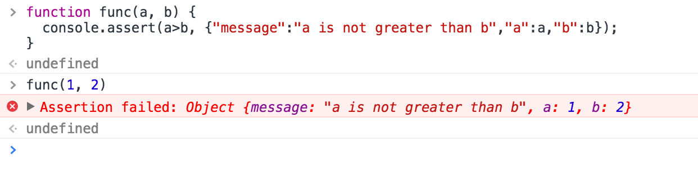

# 学会使用Console命令，让js调试更简单

首先侃一下 `console`里面具体提供了哪些方法供我们平时调试时使用。


### 一、显示信息的命令

```
console.log('显示信息');
console.info('信息');
console.error('错误');
console.warn('警告');
```

结果如下：


### 二：占位符

`console` 上述的集中度支持 `printf` 的占位符格式，支持的占位符有：`字符（%s）`、`整数（%d或%i）`、`浮点数（%f）` 和 `对象（%o）`

| Substitution string |    Description   |
| :-----: | :----- |
|`%d` or`%i`|打印整数|
|`%s`|打印字符串|
|`%f`|打印浮点数|
|`%o`|打印javascript对象，可以是整数、字符串以及JSON数据|
|`%c`|打印内容定义样式|

```
console.log('%d年%d月%d日', 2016, 08, 18);
console.log('字符：%s', 'world');
console.log('浮点数：%f', 3.1415926);
console.log('对象: %o', {a: 1});
console.log('%c this is red', 'color: red; font-size: 20px;');
```

结果如下：


### 三、信息分组

`console.group()` 和  `console.groupEnd()` 将信息分组显示。

```
console.log("This is the outer level");
console.group();
console.log("Level 2");
console.group();
console.log("Level 3");
console.warn("More of level 3");
console.groupEnd();
console.log("Back to level 2");
console.groupEnd();
console.debug("Back to the outer level");
```

结果如下：


### 四、查看对象的信息

`console.dir()` 可以显示一个对象所有的属性和方法。

```
const info = {
	name: 'zmh7057',
	age: 28,
	github: 'https://github.com/zmh7057'
};
console.dir(info);
console.log(info);

```

结果如下：


### 五、计时功能

`console.time()` 和 `console.timeEnd()`，用来显示代码的运行时间。

```
console.time('计时：');
for(let i = 0; i < 1000; i++) {
	for(let j = 0; j < 1000; j++) {
		//
	}
}
console.timeEnd('计时：');
```

结果如下：


### 六、console.profile()的性能分析

性能分析（Profiler）就是分析程序各个部分的运行时间，找出瓶颈所在，使用的方法是`console.profile()`。


```
function all() {
	for(let i = 0; i < 10; i++) {
		funcA(1000);
	}
	funcB(1000);
}

function funcA(count) {
	for(let i = 0; i < count; i++) {}
}

function funcB(count) {
	for(let i= 0; i < count; i++) {}
}

console.profile('性能分析：');
all();
console.profileEnd('性能分析：');

```

### 七、追踪函数的调用轨迹。

`console.trace()` 用来追踪函数的调用轨迹。

```
foo();

function foo() {
  function bar() {
    console.trace();
  }
  bar();
}
```

结果如下：


### 八、显示某个节点的内容

`console.dirxml()`用来显示网页的某个节点（node）所包含的html/xml代码。

```
console.dirxml(document);
```

结果如下：


### 九、判断变量是否是真

`console.assert()`用来判断一个表达式或变量是否为真。如果结果为否，则在控制台输出一条相应信息，并且抛出一个异常。

```
function func(a, b) {
  console.assert(a>b, {"message":"a is not greater than b","a":a,"b":b});
}

func(1, 2);
```

结果如下：




### 十、统计代码执行次数

`console.count()` 当你想统计代码被执行的次数（方法非常实用）。

```
function greet() {
  console.count(user + '执行的次数：');
}

var user = 'zmhan';
greet();
greet();
greet();
user = 'zmh7057';
greet();
greet();
user = 'zmhan';
greet();
```

结果如下：


### 十一、`console.table()`方法

```
console.table({
  "1471968000000": [
    {
      "id": 2372735,
      "count": 1,
      "timestamp": 1471594272370
    }
  ],
  "1472054400000": [
    {
      "id": 2372736,
      "count": 1,
      "timestamp": 1471594273186
    }
  ],
  "1472140800000": [
    {
      "id": 2372737,
      "count": 1,
      "timestamp": 1471594274155
    }
  ]
});
```

结果如下：

